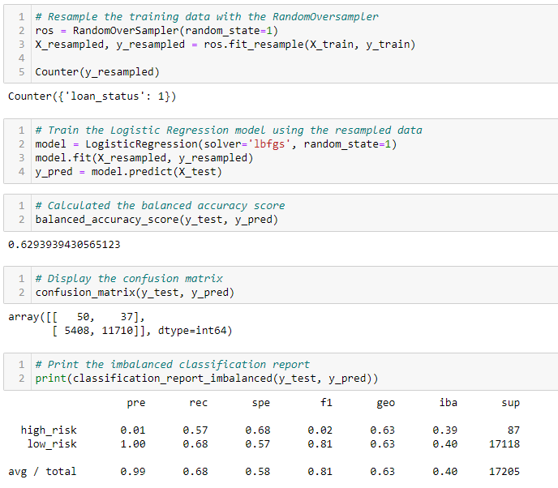
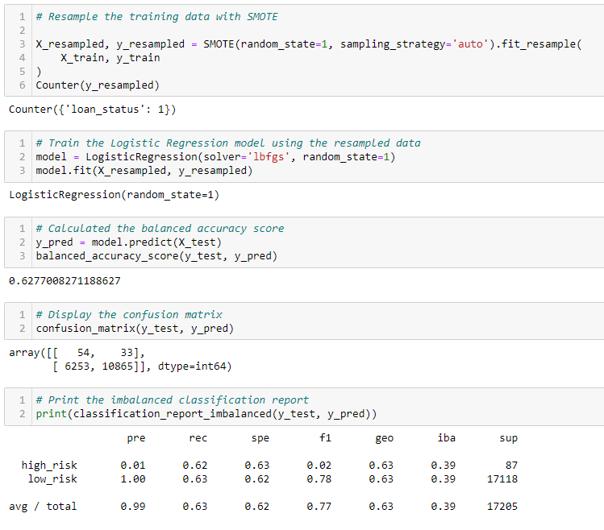
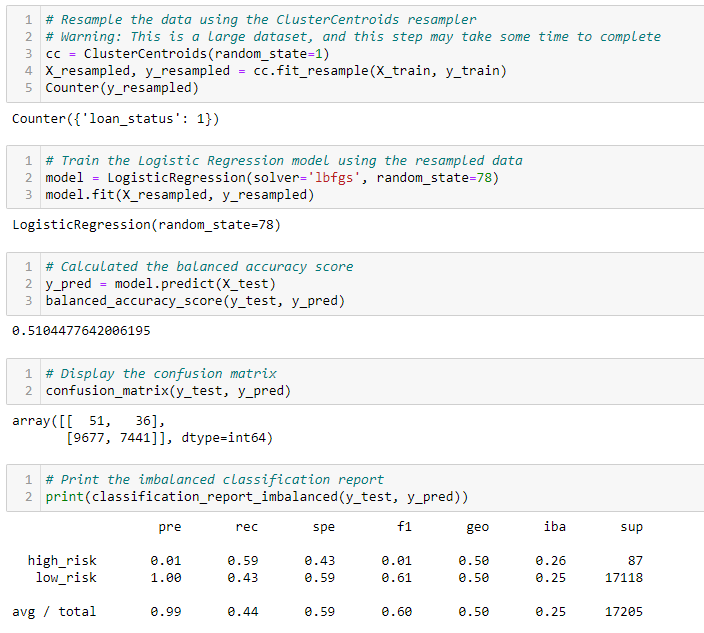
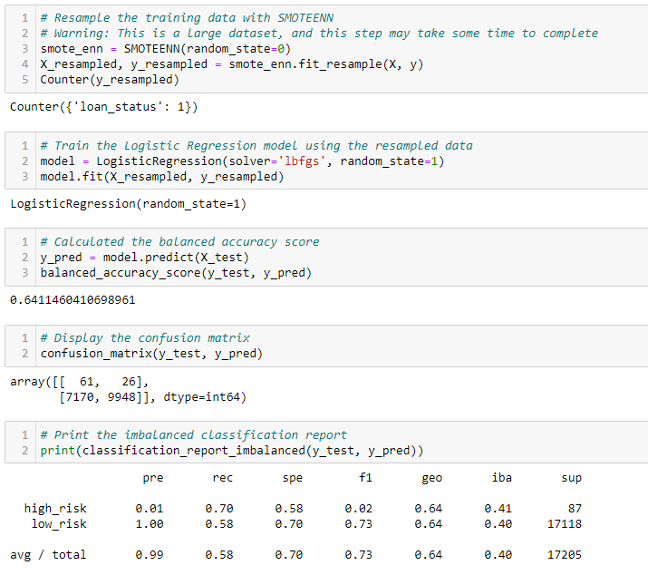
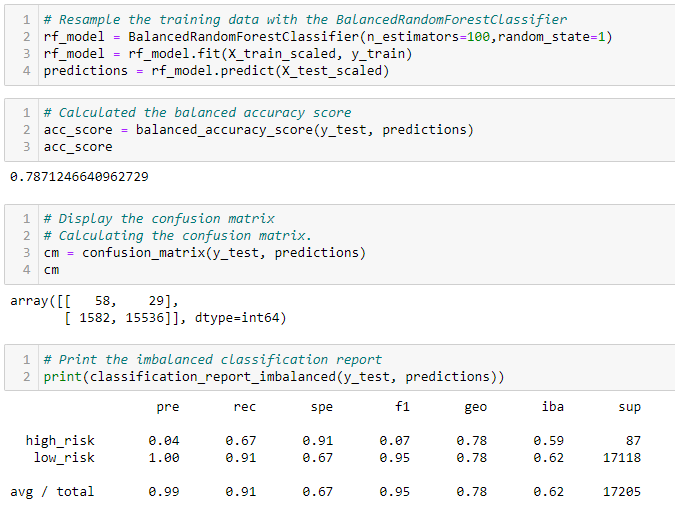
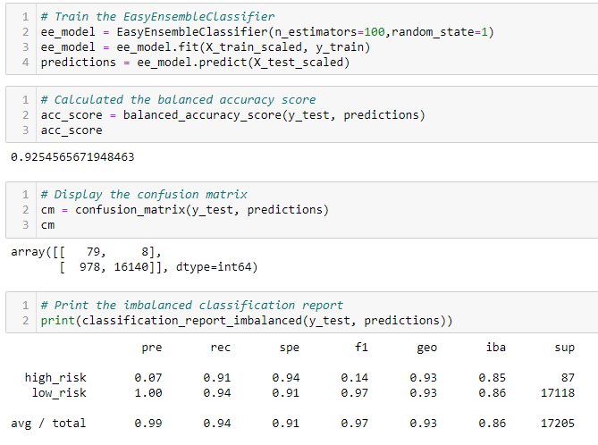

# Credit Risk Analysis

## Overview

The purpose of this analysis was to determine what kind of machine learning model will most accurately predict credit card risk. Six models were used in this analysis:

1. Naive Random Oversampling
2. SMOTE Oversampling
3. Undersampling
4. Combination Sampling
5. Balanced Random Forest Classifier
6. Easy Ensemble Classifier

## Results

- Naive Random Oversampling

    - Accuracy score: 0.63
    - Precision score: 0.99
    - Recall score: 0.68
- SMOTE Oversampling

    - Accuracy score: 0.63
    - Precision score: 0.99
    - Recall score: 0.63
- Undersampling

    - Accuracy score: 0.51
    - Precision score: 0.99
    - Recall score: 0.44
- Combination Sampling

    - Accuracy score: 0.64
    - Precision score: 0.99
    - Recall score: 0.58
- Balanced Random Forest Ensemble

    - Accuracy score: 0.79
    - Precision score: 0.99
    - Recall score: 0.91
- Easy Ensemble Classifier

    - Accuracy score: 0.93
    - Precision score: 0.99
    - Recall score: 0.94

## Summary

The precision scores for all 6 models were almost identical, all roughly 0.99. However, the precision and recall scores varied significantly. The model with the greatest precision and recall score was the Easy Ensemble Classifier model. An accuracy score and recall score of 0.99 and 0.94, respectively, place this model head and shoulders above the rest; the Easy Ensemble Classifier model's accuracy score is 0.14 higher than the second highest, and has the highest recall score as well. Therefore, the Easy Ensemble Classifier is the recommended model.
